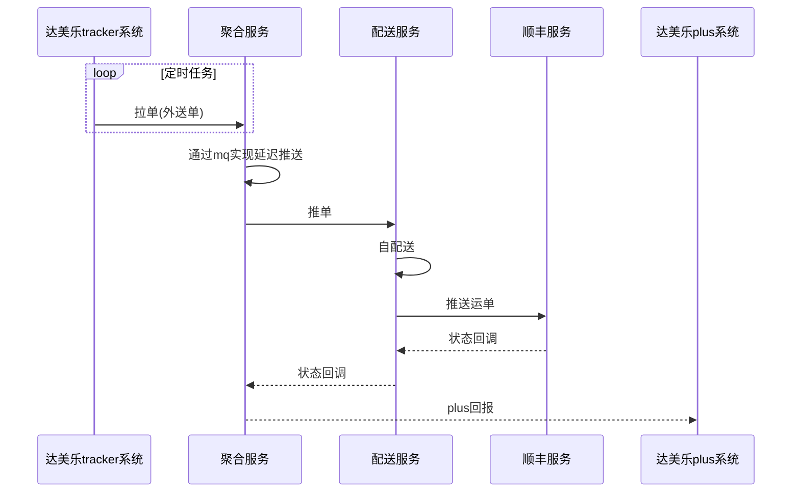
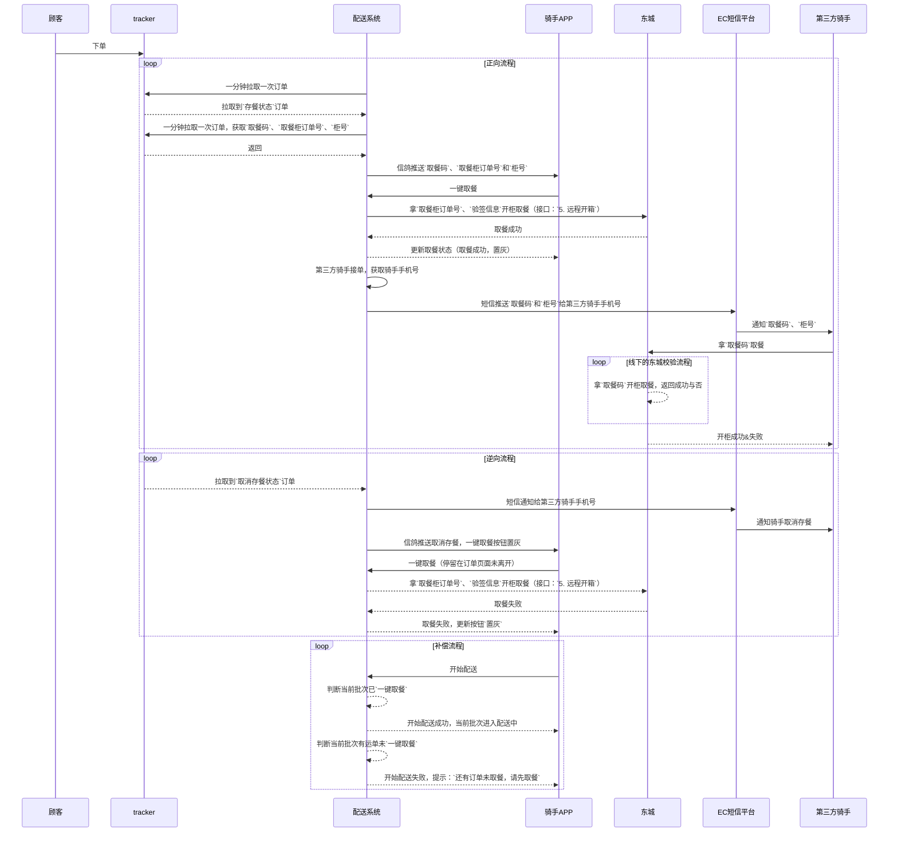
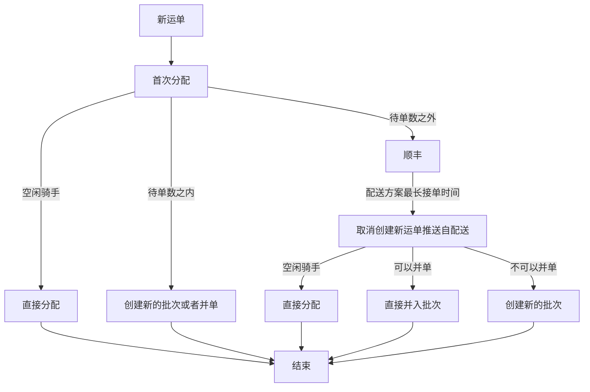

安利下 [typora](https://typora.io/) 这个markdown编辑工具

<!--more-->

界面简洁,功能强大

对于普通的markdown语法不在描述,不过我迷上了**写**流程图,为什么是写流程图不是画,是因为真的就是写出来的图

直接上用例

### 时序图

对应的实际效果图:

### 来自我们产品漂亮的时序图

实际效果(图太大,截不了全图,可以自己试试):

### 流程图

这张图确实丑了点,嗯,我现在还不熟练,但是这个流程称得上很清晰了

